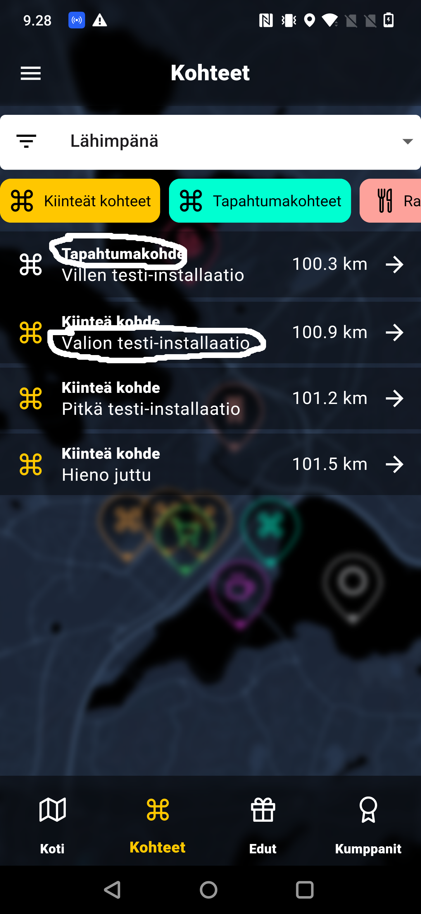
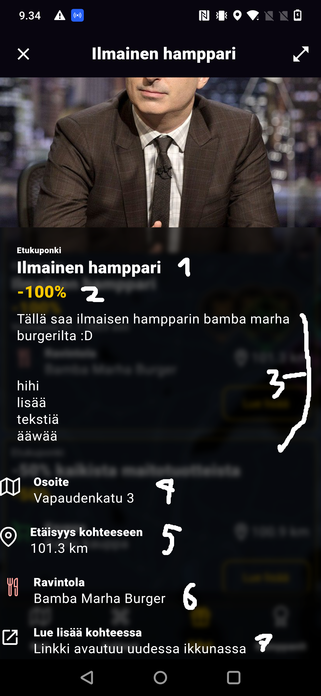

# Internal documentation for valon-kaupunki-app
## Unimplemented features (that are yet to be done):
- Favourites for partners and attractions (branch: `feature-17-hearts`). The UI is implemented [here](lib/widgets/target_info_overlay.dart), the function `_likeButton` containing the code for the like button. I suppose it's color should changed based on the state: currently it is white and outlined, when liked the icon should be pink and filled. In strapi, the content type for liked attractions is `FavouriteUser`, and its model is already implemented. A new content type should be created for partner likes.
- Any and all navigation including but likely not limited to:
    - The hamburger menu at the top
    - Attraction listing buttons
    - Backstack. Should we wrap most 'subpaths' such as the attraction and partner overlays into a `WillPopScope` and return to the parent that way? Flutter also has a `Navigator` class. I'm not sure how this would work.
    - Partner markerks should show the overlay the same way the attraction markers do.
- The front page animation, as done in Figma. Part of it is implemented [here](lib/screens/welcome_screen.dart) and [here](lib/widgets/welcome_slide_up_animation.dart).

## Stuff that you should be paying attention to
- Colors. I occasionally used a color picker from Figma, but some stuff is still completely eye-judged, and my eyes are not exactly the most accurate regarding colors.
- The way things are laid out. Some widgets have absolute margins, and stuff seemed to work on smaller screens, but still something to look at. I started this project without much knowledge in Flutter, and learned along the way, so some of the old code is... Interesting. Also, some (non-generated) files are notoriously long with long `build()` functions. Cough, cough [MapScreen](lib/screens/map_screen.dart) cough.
- Strapi response caching! Currently nothing is cached, and while there is a cloudfront running at address https://d136vmyxm8mx5v.cloudfront.net/ (which I have NOT tested), but some things could still be cached to increase efficiency. Contact Daniil in case there is an issue with the cloudfront.
- JSON serialization. The system Dart uses is horrendous, and while I'm not here to complain, the code generator does NOT run automatically when building with `flutter run`. Run `dart run build_runner build --delete-conflicting-outputs` to generate the JSON serialization classes.
- This project needs an `.env` file, which I could perhaps distribute in some internal channel? Include the variables in it by running `flutter run --dart-define-from-file .env`.

## Continuing development.
- You still need to create one more content type for favourite partners. Below shows how to create a content type and serialize it properly.
- TEST IN RELEASE MODE! Some things have previously worked in debug but not release mode. Also, whenever merging, run `flutter run --dart-define-from-file .env --profile` and navigate to the URL flutter gives you (be sure to include the query parameter!). This gives you useful information about the performance, and is usually pretty helpful in fixing issues. Clicking the URL in debug mode does NOT give a good account of the performance of the application.

## Strapi
Okay, this is the hardest part. During this entire project I have had numerous big fights with Strapi and Dart, mostly Dart because the JSON serialization just plain sucks.

The general structure for Strapi responses is as follows:
```jsonc
{
    "data": [ // an array of objects returned
        {
            "id" ...,   // unique integer representing the item *for that content type*. Two different content types can have same IDs.
            "attributes": { // the object itself. in Dart, I have aliased this to some sensible variable name with @JsonKey(name: "attributes")
                // Top-level attributes are mostly returned automatically. Images, sounds, relations etc must be populated with ?populate={image,sound,relation-name}.
            }
        }
    ],
    "meta": {
        "pagination": {
            "page": ...,
            "pageSize": ...,
            "pageCount": ...,
            "total": ...
        }
    }
}
```
Generally, the naming convention for me has been as follows:
- For all content types, there is a different top-level object. It is called `Strapi{type}Response`, such as `StrapiAttractionResponse`, `StrapiPartnersResponse`. It is defined in [strapi_resp.dart](lib/api/model/strapi_resp.dart) It looks always like this, where `{type}` is the type of the object you're looking for:
```dart
@JsonSerializable()
class Strapi{type}Response {
    final StrapiResponseMeta? meta; // optional and as such nullable, see below
    final List<{type}> data;

    const Strapi{type}Response(this.data, this.meta);

    factory Strapi{type}Response.fromJson(Map<String, dynamic> json)
        = _$Strapi{type}ResponseFromJson(json);
}
```
Dart infers the JSON keys from the field names. Looking at the response above, you can see how they map to the top-level JSON object.

- For the `data` key, there is always a type called `Strapi{type}`, always in [strapi_resp.dart](lib/api/model/strapi_resp.dart). Think `StrapiAttraction`, `StrapiBenefit` etc:
```dart
@JsonSerializable()
class Strapi{type} {
    final int id;
    @JsonKey(name: "attributes")
    {type} {name}; // name being some sensible member name, for example 'benefit' if the {type} is 'Benefit'.

    const Strapi{type}(this.{name}, this.id);

    factory Strapi{type}.fromJson(Map<String, dynamic> json)
        = _$Strapi{type}FromJson(json);
}
```
Note: if you only need the ID (such as for objects that only need to exist or be deleted since deletion only requires `DELETE {strapiUrl}/api/{content-type-plural}/{id}`), use the type `OnlyId` (defined in [strapi_resp.dart](lib/api/model/strapi_resp.dart)) in place of the `Strapi{type}` objects.

For objects that are not necessary to exist under a key, define the key property as nullable and Dart shall automatically treat it as optional.

Since Dart maps return `null` when a nonexistent key is accessed, errors like this just mean that you either forgot to declare a property as optional or your JSON structures are incorrect:
```
E/flutter (11964): [ERROR:flutter/runtime/dart_vm_initializer.cc(41)] Unhandled Exception: type 'Null' is not a subtype of type 'Map<String, dynamic>' in type cast
```

This way of writing JSON also means that your client code will have lots of `non!.null!.assertions!`, and you just have to know when you have populated a relation in the response or not.

## How Strapi properties map to the UI:


The first circle is a localized version of the category. It can be obtained with `getAttractionCategoryLabel(attraction.category)`.

The second circle is the name of attraction, from strapi `Attraction::title`.



1. Strapi `Benefit::title`
2. Strapi `Benefit::benefitText`
3. Strapi `Benefit::description`
4. Strapi `Benefit::partner::address`
5. Strapi `Benefit::partner::location` and the distance to the current location
6. Strapi `Benefit::partner::name`
7. Strapi `Benefit::partner::link`
